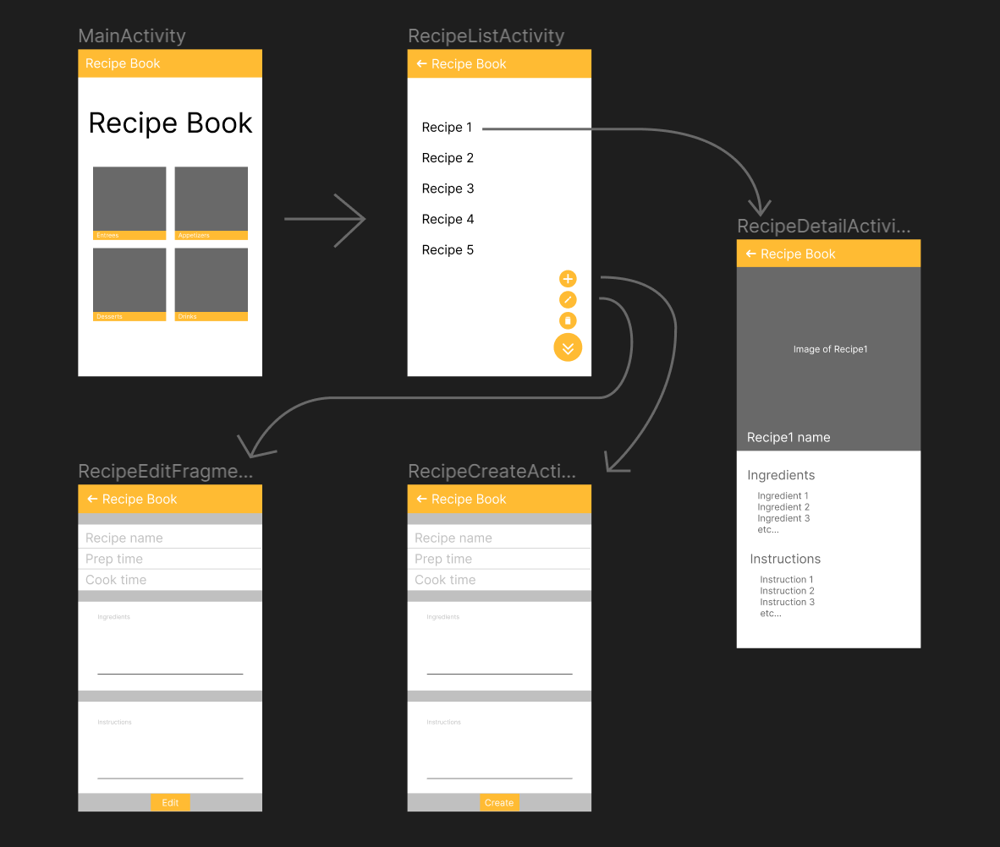
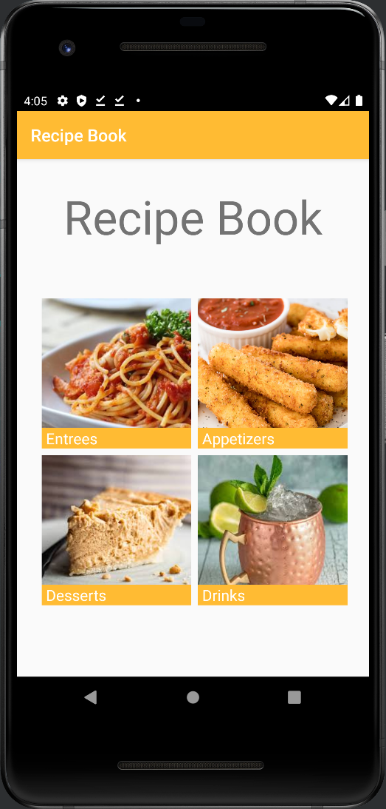
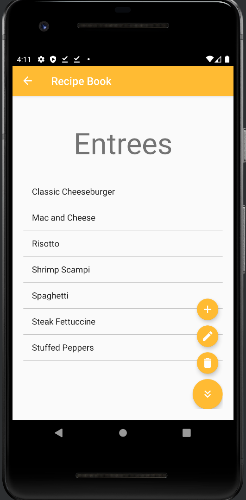
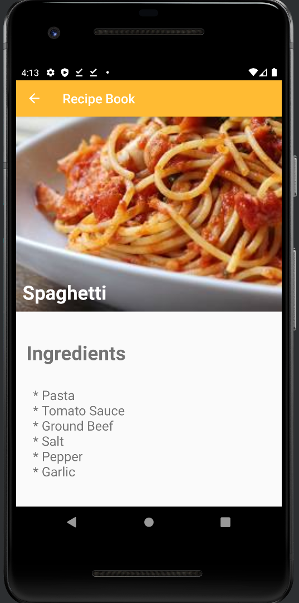

# Recipe-Book
Recipe Book is an Android app that allows users to log their favorite recipes. We wanted to create the app so that it is easy to use and pleasant looking. The app was created using the AndroidSDK and Gradle for project synchronization. For data persistence, the app stores recipes using the Android RoomDatabase. That implementation incorporates a public RecipeDao (data access object), RecipeDatabase which extends the RoomDatabase, and RecipeRepository - a singleton class acting as an interface between the database itself and the user's desired crud operations. Creating, updating, or deleting operations are ran on a background thread, but not reading as it is more of intensive operation as it has to display all recipes to the user as the user navigates the app. This project was for a grade and was created by students at Florida State University and received a 100%.

## App Wireframe

## Screenshots
### Home
<!--  -->

### Recipe List

### Recipe Detail

## App contributors
* Stanley Vossler
* [Theodor Owchariw](https://github.com/TheodorOwchariw "His GitHub profile")

